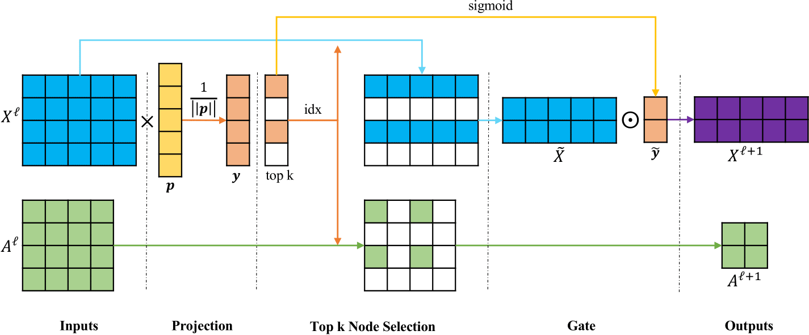
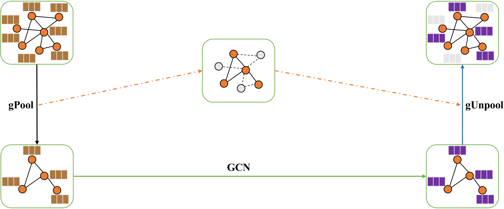
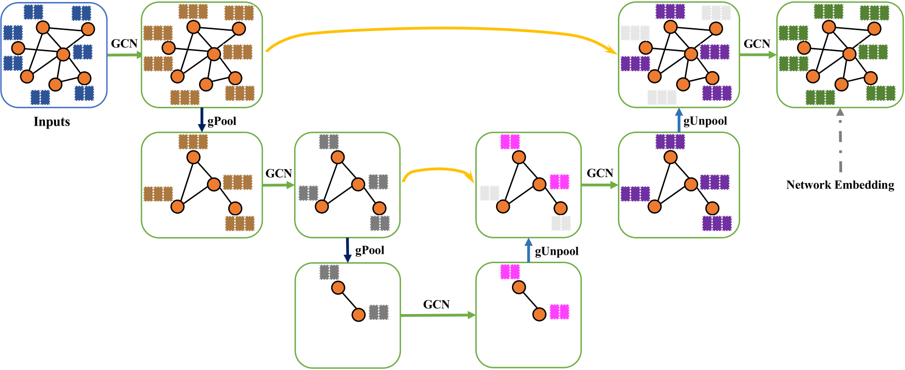

PyTorch Implementation of GIUNets
======================================

Created by [Zahra Dehghanian](https://faculty.sites.iastate.edu/hygao/) @ Iowa State University,[Saeed Saravani](https://faculty.sites.iastate.edu/hygao/) @ Iowa State University, and
[Alireza Amouzad](http://people.tamu.edu/~sji/) @ Amirkabir University of Technology.

About
-----

PyTorch implementation of GIUNets. Check http://proceedings.mlr.press/v97/gao19a/gao19a.pdf for more information.

Methods
-------

### pqPooling : Pooling Layer

### pastUnpool : Unpooling Layer

### GIUNet Structure

Installation
------------

Type

    ./run_GNN.sh DATA FOLD GPU
to run on dataset using fold number (1-10).

You can run

    ./run_GNN.sh DD 0 0
to run on DD dataset with 10-fold cross
validation on GPU #0.

Code
----

The detail implementation of GIUNet is in src/utils/ops.py.

Datasets
--------

Check the "data/README.md" for the format. 

Results
-------

| Models   | DD              | IMDBMULTI       | PROTEINS        |
| -------- | --------------- | --------------- | --------------- |
| PSCN     | 76.3 ± 2.6%     | 45.2 ± 2.8%     | 75.9 ± 2.8%     |
| DIFFPOOL | 80.6%           | -               | 76.3%           |
| SAGPool  | 76.5%           | -               | 71.9%           |
| GIN      | 82.0 ± 2.7%     | 52.3 ± 2.8%     | 76.2 ± 2.8%     |
| g-U-Net  | **83.0 ± 2.2%** | **56.7 ± 2.9%** | **78.7 ± 4.2%** |

Reference
---------

If you find the code useful, please cite our paper:

    @inproceedings{gao2019graph,
        title={Graph U-Nets},
        author={Gao, Hongyang and Ji, Shuiwang},
        booktitle={International Conference on Machine Learning},
        pages={2083--2092},
        year={2019}
    }
